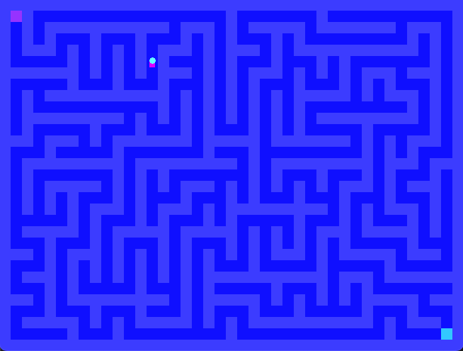

# ASM Graphics Library



A minimal graphics library written in ARM64 assembly for macOS, featuring a **custom software rasterizer**. SDL2 is used only for window/input — all drawing is done pixel-by-pixel in our own code!

## Features

- **Software Rasterizer**: Our own framebuffer and pixel-level drawing
- **Classic Algorithms**: Bresenham's line, midpoint circle
- **Native Keyboard**: Direct keyboard via CoreGraphics (no SDL input!)
- **Console Printing**: Print strings, integers, and hex values via syscalls
- **Window Management**: SDL2 for window creation and blitting only

## Project Structure

```
asm_gfx/
├── include/
│   └── constants.inc    # Shared constants and SDL defines
├── src/
│   ├── lib/
│   │   ├── print.s      # Console printing utilities
│   │   ├── window.s     # Window/renderer management (SDL2)
│   │   ├── draw.s       # SDL drawing primitives (legacy)
│   │   ├── input.s      # SDL input (legacy, kept for window events)
│   │   ├── raster.s     # ★ Software rasterizer (our code!)
│   │   └── keyboard.s   # ★ Native keyboard (CoreGraphics, no SDL!)
│   └── demo.s           # Demo entry point
├── build/               # Build output (created by make)
├── Makefile
└── README.md
```

## Requirements

- macOS (Apple Silicon or Intel)
- Xcode Command Line Tools
- SDL2 library

## Quick Start

### 1. Install SDL2

```bash
make install-sdl
# or manually:
brew install sdl2
```

### 2. Build

```bash
make
```

### 3. Run

```bash
make run
# or directly:
./build/demo
```

## Controls

| Key | Action |
|-----|--------|
| ↑ / W | Move up |
| ↓ / S | Move down |
| ← / A | Move left |
| → / D | Move right |
| ESC / Q | Quit |

## Library API

### Print Module (`print.s`)

```asm
// Print a null-terminated string
adrp    x0, my_string@PAGE
add     x0, x0, my_string@PAGEOFF
bl      _print_str

// Print newline
bl      _print_newline

// Print integer
mov     x0, #42
bl      _print_int

// Print hex
mov     x0, #0xDEADBEEF
bl      _print_hex
```

### Window Module (`window.s`)

```asm
// Initialize (title, width, height)
adrp    x0, title@PAGE
add     x0, x0, title@PAGEOFF
mov     w1, #800
mov     w2, #600
bl      _gfx_init

// Set draw color (R, G, B, A)
mov     w0, #255
mov     w1, #0
mov     w2, #0
mov     w3, #255
bl      _gfx_set_color

// Clear and present
bl      _gfx_clear
bl      _gfx_present

// Cleanup
bl      _gfx_quit
```

### Draw Module (`draw.s`)

```asm
// Filled rectangle (x, y, w, h)
mov     w0, #100
mov     w1, #100
mov     w2, #50
mov     w3, #50
bl      _draw_rect

// Rectangle outline
bl      _draw_rect_outline

// Line (x1, y1, x2, y2)
mov     w0, #0
mov     w1, #0
mov     w2, #100
mov     w3, #100
bl      _draw_line

// Single point (x, y)
mov     w0, #50
mov     w1, #50
bl      _draw_point
```

### Keyboard Module (`keyboard.s`) ★ Native Input

Uses CoreGraphics `CGEventSourceKeyState` - no SDL dependency!

```asm
// Update key states (call each frame)
bl      _keyboard_update

// Get pointer to key state array
bl      _keyboard_get_state
mov     x2, x0

// Check specific keys using KEY_* constants
ldrb    w0, [x2, #KEY_UP]
cbnz    w0, handle_up

ldrb    w0, [x2, #KEY_ESCAPE]
cbnz    w0, quit_game

// Available key constants:
// KEY_UP, KEY_DOWN, KEY_LEFT, KEY_RIGHT
// KEY_ESCAPE, KEY_SPACE
// KEY_W, KEY_A, KEY_S, KEY_D, KEY_Q

// Or check individual key directly (Mac virtual keycode)
mov     w0, #0x7E              // kVK_UpArrow
bl      _keyboard_is_pressed
cbnz    w0, up_is_pressed
```

### Legacy Input Module (`input.s`)

Still used for window close events only:

```asm
// Poll SDL events (for window close button)
bl      _input_poll

// Check if window was closed
bl      _input_should_quit
cbnz    w0, exit_loop
```

### Raster Module (`raster.s`) ★ Software Renderer

```asm
// Initialize framebuffer (width, height)
mov     w0, #800
mov     w1, #600
bl      _raster_init

// Set drawing color (R, G, B, A)
mov     w0, #255
mov     w1, #0
mov     w2, #128
mov     w3, #255
bl      _raster_set_color

// Clear entire framebuffer with current color
bl      _raster_clear

// Plot single pixel (x, y)
mov     w0, #100
mov     w1, #200
bl      _raster_plot

// Draw line - Bresenham's algorithm (x0, y0, x1, y1)
mov     w0, #0
mov     w1, #0
mov     w2, #400
mov     w3, #300
bl      _raster_line

// Draw filled rectangle (x, y, width, height)
mov     w0, #100
mov     w1, #100
mov     w2, #50
mov     w3, #50
bl      _raster_rect

// Draw rectangle outline
bl      _raster_rect_outline

// Draw circle outline - midpoint algorithm (cx, cy, radius)
mov     w0, #400
mov     w1, #300
mov     w2, #100
bl      _raster_circle

// Draw filled circle
bl      _raster_circle_filled

// Blit framebuffer to screen
bl      _raster_get_buffer   // x0 = buffer ptr
adrp    x1, _fb_pitch@PAGE
add     x1, x1, _fb_pitch@PAGEOFF
ldr     w1, [x1]             // w1 = pitch
bl      _gfx_blit

// Free framebuffer on exit
bl      _raster_free
```

## Constants (`constants.inc`)

Key constants available:
- `WINDOW_WIDTH`, `WINDOW_HEIGHT`
- `COLOR_*` (BLACK, WHITE, RED, GREEN, BLUE, etc.)
- `SDL_SCANCODE_*` (UP, DOWN, LEFT, RIGHT, ESCAPE)
- `MOVE_SPEED`, `DEFAULT_SQUARE_SIZE`

## Extending the Library

### Adding New Shapes

Add functions to `draw.s`:

```asm
.global _draw_circle

_draw_circle:
    // Your implementation using SDL_RenderDrawPoint
    // for each pixel on the circle
    ret
```

### Adding New Demos

Create a new file in `src/`:

```asm
.global _main
.include "include/constants.inc"

_main:
    // Your demo code
    ret
```

Update the Makefile to build your demo.

## Architecture Notes

This library targets ARM64 (Apple Silicon). Key calling convention details:
- Arguments: x0-x7 (w0-w7 for 32-bit)
- Return value: x0
- Callee-saved: x19-x28
- Frame pointer: x29
- Link register: x30
- Stack must be 16-byte aligned

## License

MIT

